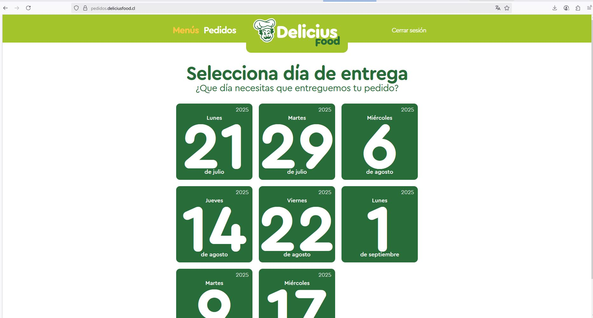
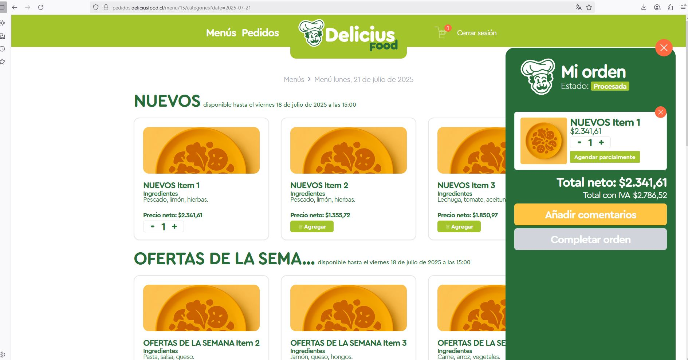
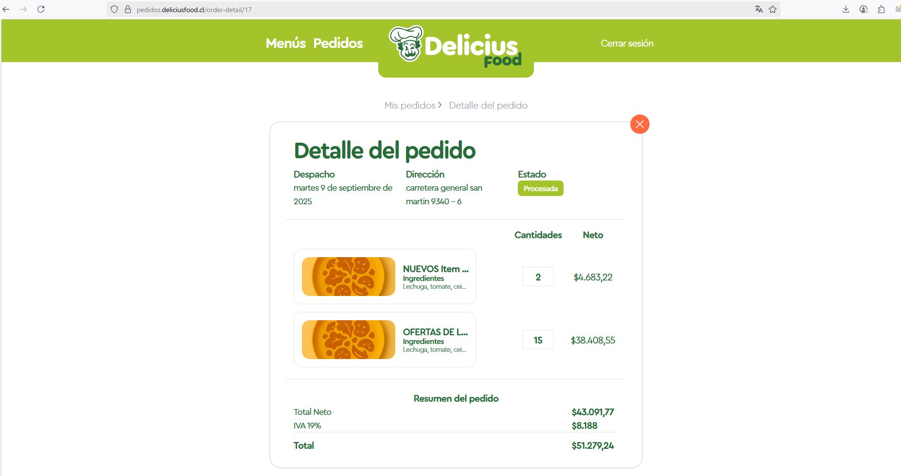
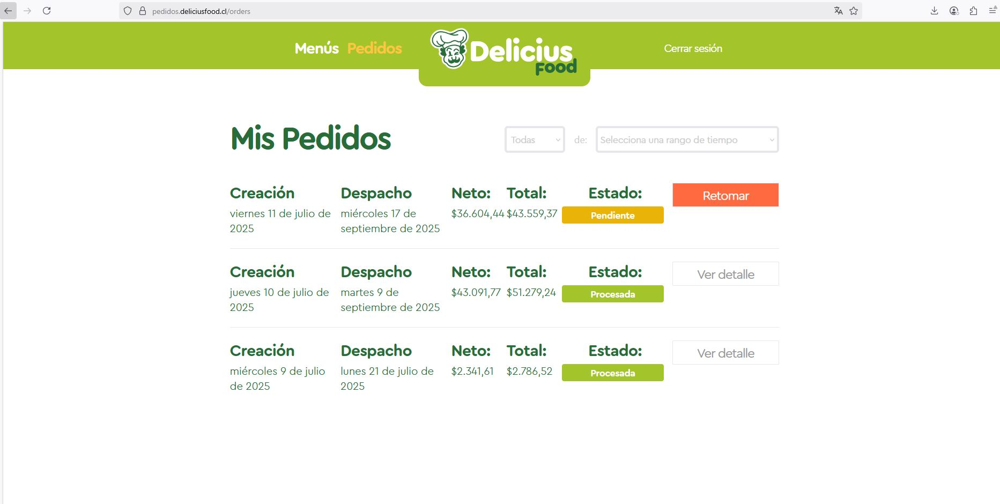

# DeliciusFood CRM - Frontend

## General Description
Frontend for the CRM system designed to manage prepared meal sales. This application consumes the APIs from the [backend](https://github.com/thirty33/DELICIUS-FOOD-CRM) and provides an intuitive user interface to manage all aspects of the prepared food delivery business.

## Main Features
- Responsive and modern interface
- Weekly menu calendar
- Order management with different statuses
- Detailed order view with history
- Shopping cart for customers
- Product visualization by categories
- Price list management

## Screenshots

### Menu Calendar


The calendar view allows visualization of available menus by day, facilitating weekly planning. Each day displays a representative image of the menu and the corresponding date.

### Menus by Category


Products are organized by categories (Daily Menu, Special Sandwiches, etc.) with images, prices, and ingredient listings. Each category shows the time limit for availability.

### Shopping Cart


The shopping cart allows customers to manage selected products, modify quantities, and remove items before completing their order.

### Orders List


The orders view shows a complete history with creation dates, delivery dates, and current status. Customers can view details or resume pending orders.

### Order Detail


The detailed view of an order includes information about status, dates, delivery address, and a complete list of products with prices and taxes.

### Order Summary


The final summary displays totals with and without taxes and offers options to complete the purchase or return to the order list.

## Technologies Used
- React
- Vite
- Tailwind CSS
- Axios for API communication
- Vue Router / React Router

## Configuration

### Prerequisites
- Node.js v16 or higher
- npm v8 or higher

### Installation
1. Clone the repository:
```bash
git clone [REPOSITORY_URL]
cd delicius-food-frontend
```

2. Install dependencies:
```bash
npm install
```

3. Configure environment variables:
Copy the `.env.example` file to a new file called `.env`:
```bash
cp .env.example .env
```

4. Configure the `VITE_API_URL` variable in the `.env` file to point to the backend:
```
VITE_API_URL=http://dev.backoffice.deliciusfood-test.ai
```

Note: It is recommended to add this address to the operating system's hosts file:
```
127.0.0.1 dev.backoffice.deliciusfood-test.ai
```

### Development Execution
```bash
npm run dev
```

### Production Build
```bash
npm run build
```

## Backend Integration
This frontend consumes the APIs from the backend hosted at [https://github.com/thirty33/DELICIUS-FOOD-CRM](https://github.com/thirty33/DELICIUS-FOOD-CRM). Make sure the backend is configured and running for the correct functioning of the application.

## License
contact: joelsuarez.1101@gmail.com

## Support
contact: joelsuarez.1101@gmail.com